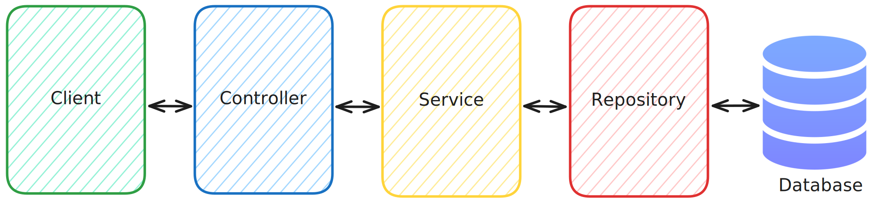

  
  <h1 align="center">Movie Hub API</h1>

 

  
Table of Contents

  <ol>
    <li>
      <a href="#built-with">Built With</a>
    </li>
    <li>
      <a href="#architecture">Architecture</a>
    </li>
    <li>
      <a href="#getting-started">Database</a>
    </li>
    <li><a href="#usage">API</a></li>
  </ol>

## Built With

- 
- 
- 
- 
- 
- 

(<a href="#readme-top">back to top</a>)

## Architecture

For this project, I opted for a classical layered architecture, which is widely used in Spring Boot applications. This architecture separates concerns by dividing the application into distinct layers, each responsible for specific tasks, enhancing maintainability, scalability, and testability.

The typical layers in this architecture include:

- **Controller Layer**: Handles HTTP requests and responses, forwarding requests to the appropriate service layer.
- **Service Layer**: Contains the business logic and interacts with the data layer to fetch or manipulate data.
- **Repository Layer**: Responsible for data access and interacts with the database.

## Database

This section showcases the PostgreSQL database structure or schema diagram used in the project.
It provides an overview of the data relationships and design choices made for the application.
The database is created using **Liquibase**.

### Optimization

Due to the extensive relationships in the movie table (and other related tables), I implemented **LAZY fetching** for all relationships across the tables.
This approach prevents unnecessary data from being fetched when retrieving a specific entity, improving performance and efficiency.

By using lazy fetching, I avoid fetching related entities (such as comments, ratings, cast, etc.) unless they are explicitly required.
This strategy helps mitigate the **N+1 query problem**, which would occur if all relationships were fetched eagerly, potentially leading to performance bottlenecks due to excessive database queries.

With lazy fetching, when I fetch a movie entity, I only retrieve the movie itself.
If I need additional related data, I fetch it manually.
This optimization significantly improved the performance of my application, as previously, fetching a movie would also pull in all associated data, slowing down the application.

(<a href="#readme-top">back to top</a>)

## API

The Movie Hub API is documented and described using **OpenAPI** Specification. You can view and interact with the API documentation locally using **SwaggerUI**.

Once the application is running, the SwaggerUI interface can be accessed by navigating to the following URL in your browser:

http://localhost:8080/swagger-ui/index.html

This interface provides a user-friendly way to explore the available API endpoints, view detailed information about each endpoint, and make requests directly from the browser.

The OpenAPI file can be found here:

[OpenAPI Specification](../openapi.yaml)

(<a href="#readme-top">back to top</a>)
